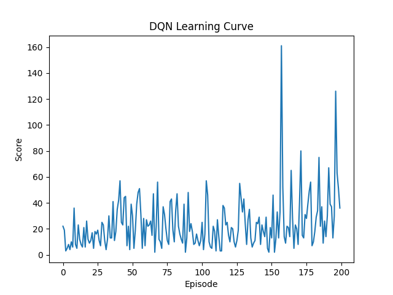

# DodgeSquare: A Deep RL Survival Benchmark

[](https://www.python.org/downloads/)
[](https://pytorch.org/)
[](https://opensource.org/licenses/MIT)

## 1. Project Overview
**DodgeSquare** is a reinforcement learning project that trains an autonomous agent to dodge randomized obstacles in a continuous 2D environment.   
By implementing a **Deep Q-Network (DQN)**, the agent learns to interpret spatial coordinates and velocities to maximize its survival time.  
This project demonstrates the transition from stochastic exploration to sophisticated predictive dodging.

## 2. Key Features
- **DQN Architecture**: Utilizes a multi-layer fully connected network (128-64-3) with ReLU activation for complex state-action mapping.
- **Adaptive Epsilon-Greedy Strategy**: Balances exploration and exploitation via episodic decay, ensuring robust policy convergence.
- **Advanced State Representation**: A 4-dimensional normalized vector consisting of Agent/Obstacle coordinates and velocities.
- **Interactive UI**: Includes a comprehensive start menu, multi-life system (3 lives), and a Game Over state machine for both AI and manual play.

## 3. Technology Stack
- **Language**: Python 3.8+ 
- **DL Framework**: PyTorch 
- **Game Engine**: Pygame 
- **Analysis**: Matplotlib (for learning curve visualization) 

## 4. Performance Results
The following learning curve demonstrates the agent's performance over 200 training episodes.


### Key Observations
1. **Stochastic Phase**: In early episodes, the agent moves randomly with a high Epsilon ($\epsilon = 1.0$), resulting in frequent collisions.
2. **Convergence**: As the Epsilon decays, the agent relies more on its learned Q-values, leading to stable survival scores and higher average rewards.
3. **Robustness**: The agent successfully learns to avoid obstacles even with randomized speeds, proving the effectiveness of the DQN model.


## 5. Getting Started
### Installation
```bash
pip install -r requirements.txt
```

### Usage
To train the AI: Run python main.py and click the screen to start the process.
To play manually: Run python env.py to test physics, UI controls, and the Game Over state.

## 6. References
[1] Wang, X. (2025). TankWar: Tank battle game [Computer software]. GitHub.  
[2] IronSpiderMan. (2020). TankWar: Classic tank battle game implemented with Python and Pygame [Computer software]. GitHub.  
[3] te. (2025). Tetris-deep-Q-learning-pytorch [Computer software]. GitCode.  

